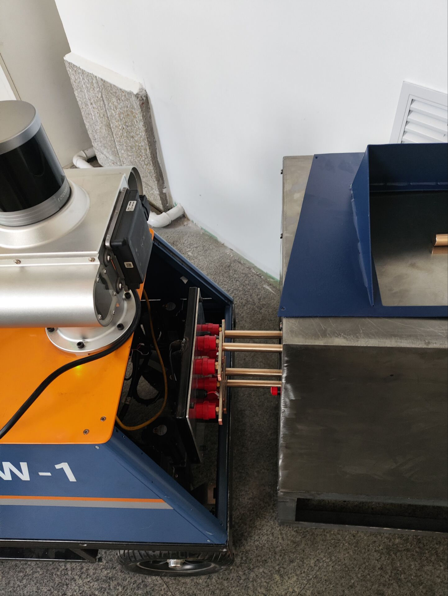
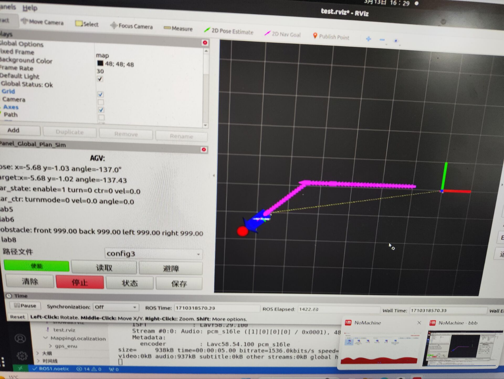

## 连续退火炉巡检机器人控制系统设计

### ROS包功能
* 启动各种传感器的底层驱动，启动与底层运动驱动器间的UDP通信
* 启动激光雷达监控RVIZ界面
* 启动转台操作与监控RVIZ界面、车辆信息监控界面、路径显示界面
* 可以根据预设定的路径进行跟踪并在作业点进行检测作业
* 在跟踪点遇到障碍物时会停止运动进行避让
* 当跟踪误差角过大时会原地自转调整角度再重新进行跟踪
* 检测时会使用红外相机、CCD相机进行拍摄检测

### ROS包启动方法
> 主功能启动：roslaunch global_plan_sim run.launch
> MQTT远程操作：roslaunch mqtt_comm run_test.launch

### 路径设置说明
<pre><code>

accordingPathdir: true # true则heading设置无效，路径方向只允许与路径点方向一致
onlyAkm: false  # true则不允许在大误差时使用自转对齐

pose0:     
  map_x: -0.9
  map_y: 0.11
  heading: 180
  vel: 0.2
  caption: "A000"
  # action0: ["act0", 20, 60, 10]
  # action1: ["act1", 0, 0, 1] 

pose1:     
  map_x: -3.6
  map_y: 0.11
  heading: 180
  vel: 0.2
  caption: "A001"
  # action0: ["act0", 20, 60, 5]
  # action1: ["act1", 0, 0, 1] 
</code></pre>
* 可以设置路径的坐标点、在点上的目标朝向以及通过点的速度
  > 本车运动部分设置了在路径开始和结束进行缓慢加减速的机制，因此路径刚开始与要结束处附近的路径点可能vel设置会无效
* caption是任务id，用于生成以此为名字的检测数据保存文件夹
* action是转台的动作组，目前workctr节点中仅允许两个位置，会在到达第一个位置后进行拍摄检测

### 相关原理
* 节点具体实现与消息类型见doc目录下说明文档
* 轨迹跟踪方案为纯跟踪
* 采用的建图方式为LIO-SAM，利用NDT matching进行匹配
* 上述匹配方式需要相对准确的初始位姿，因此在运行时实时保存位姿作为下次启动的初始位姿

### 效果演示

